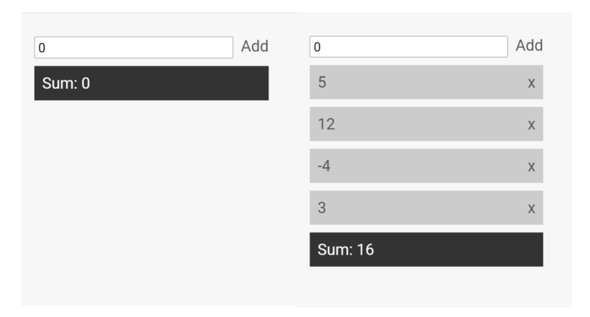

# README

## Question 1

How would you explain the three different layers (front-end, back-end and database) of a typical web application to a 10-year-old child, using a real-life analogy?

Front end is like when your friend or cousins come over to spend some time with us, we would put our best behavior in front of your friend or cousins and greet them with great respect and do everything to enjoy their company.

Backend is like when your mother or father spends some time in the kitchen to serve your friend or cousins some food or coffee or cook full dinner.

The database is like the fridge which contains some cooked food and some uncooked food. In either case, the food needs to be reheated when already cooked before the food can be served to your friend or cousins.

## Question 2

A colleague of yours submitted this code as part of a pull request that you review in a JavaScript project.

1. Would you accept it? ❌
2. If not, what comments would you write?

```javascript
// Loops the users array and based on the
function users(users) {
    for (const i = 0; i < users.length; i++) {
        if (users[i].age < 18) {
            users.splice(i, 1)
    }
    return users;
}
```

No. This code will throw a run time error. The `if` statement closure is not closed or if that is closed then the function `users` closure is not closed.

Line 1: The description is incomplete. It does not make sense.
Line 3: There needs to be some sanity check that `users` is an `Array` before the `for` loop
Line 4: The `if` statement is assuming that items of `users` are JSON object.

## Question 3

We received the following requirements for a cloud-based email application we need to develop:
● The application will receive incoming emails and store them in a database.
● The application will have multiple users.
● For each user we need to store the list of emails they have received.
● A user may organise his emails in a folder hierarchy – each email user must have his/her own folder hierarchy.
Note that for this exercise we are concerned only with the basic database schema. Use any database system you prefer (MongoDB, SQL or anything you are familiar with) to answer the questions:

### 1. Provide a database schema for the most important entities. You can do it using any way that is convenient to you: e.g. a diagram that shows the tables with their columns or SQL queries or a popular ORM (e.g. mongoose for MongoDB)

There is an [`sqlite`](./smg.sqlite) file which contains the data structure as well for live interaction

`email` entity

```sql
CREATE TABLE `email` (
 `emailId` VARCHAR(50) NOT NULL,
 `content` LONGTEXT(1000000) NOT NULL,
 `fromEmail` VARCHAR(100) NOT NULL,
 `toEmail` VARCHAR(100) NOT NULL,
 `receivedTime` TIMESTAMP NOT NULL,
 PRIMARY KEY (`emailId`)
);
```

`user` entity

```sql
CREATE TABLE `user` (
 `userId` VARCHAR(50) NOT NULL,
 `email` VARCHAR(100) NOT NULL,
 PRIMARY KEY (`userId`)
);
```

`folder` entity

```sql
CREATE TABLE `folder` (
 `folderId` VARCHAR(50) NOT NULL,
 `userId` VARCHAR(50) NOT NULL,
 `name` VARCHAR(100) NOT NULL,
 `subFolderId` VARCHAR(50),
 FOREIGN KEY(`userId`) REFERENCES user(`userId`),
 FOREIGN KEY(`subFolderId`) REFERENCES folder(`folderId`),
 PRIMARY KEY (`folderId`)
);
```

`folderEmail` entity

```sql
CREATE TABLE `folderEmail` (
 `folderId` VARCHAR(50) NOT NULL,
 `emailId` VARCHAR(50) NOT NULL,
 FOREIGN KEY(`folderId`) REFERENCES folder(`folderId`),
 FOREIGN KEY(`emailId`) REFERENCES email(`emailId`),
 PRIMARY KEY (`folderId`, 'emailId')
);
```

### 2. Provide a query that for a given user and folder name, it returns all the emails in reverse chronological order (most recent should be first)

#### Inserting dummy data

Lets insert some dummy data into the tables

```sql
INSERT INTO email (`emailId`,`content`,`from`,`to`,`receivedTime`) VALUES('9f2f5f90-f6b2-4ccb-bd13-de9fad551bbc', 'Hello World 1', 'hello@smg.com', 'world@smg.com', 1674404894);
INSERT INTO email (`emailId`,`content`,`from`,`to`,`receivedTime`) VALUES('487764ff-1a9d-48d5-83f8-4d02d1c08825', 'Hello World 2', 'hello@smg.com', 'world@smg.com', 1674404900);
INSERT INTO email (`emailId`,`content`,`from`,`to`,`receivedTime`) VALUES('5ac1b370-5f04-40c3-a20c-a2952566f9c0', 'Hello World 3', 'hello@smg.com', 'world@smg.com', 1674404908);
INSERT INTO email (`emailId`,`content`,`from`,`to`,`receivedTime`) VALUES('363d9f96-bf01-46c6-92a2-bb30ab798f30', 'Hello World 4', 'hello@smg.com', 'world@smg.com', 1674404927);
INSERT INTO email (`emailId`,`content`,`from`,`to`,`receivedTime`) VALUES('e3f328fb-8f13-4ae9-902f-6378254e5b1c', 'Hello World 5', 'hello@smg.com', 'world@smg.com', 1674405092);
INSERT INTO email (`emailId`,`content`,`from`,`to`,`receivedTime`) VALUES('e4051e6b-fea8-4382-8033-9fcc19a84174', 'Hello World 6', 'hello@smg.com', 'world@smg.com', 1674405097);
INSERT INTO email (`emailId`,`content`,`from`,`to`,`receivedTime`) VALUES('6c2c3819-a398-4a63-8fb6-1dd76e5d2300', 'Hello World 7', 'hello@smg.com', 'world@smg.com', 1674405101);
INSERT INTO email (`emailId`,`content`,`from`,`to`,`receivedTime`) VALUES('bb7ff58c-a0cd-47f4-ac65-3a3b308d858b', 'Hello World 8', 'hello@smg.com', 'world@smg.com', 1674405107);
```

Now the same thing for `user`

```sql
INSERT INTO user (`userId`,`email`) VALUES('f99f0fd4-15c6-48c1-8291-15eeb3030d0b', 'world@smg.com');
```

Now the same thing for the `folder`

```sql
INSERT INTO folder (`folderId`,`userId`,`name`,`subFolderId`) VALUES('7421ad0b-6092-48a3-808b-7c6ea7eb8697', 'f99f0fd4-15c6-48c1-8291-15eeb3030d0b', 'Folder 1', NULL);
INSERT INTO folder (`folderId`,`userId`,`name`,`subFolderId`) VALUES('4fdea030-4f56-4ced-bdea-58a8f34ee1db', 'f99f0fd4-15c6-48c1-8291-15eeb3030d0b', 'Folder 1 of 1', '7421ad0b-6092-48a3-808b-7c6ea7eb8697');
INSERT INTO folder (`folderId`,`userId`,`name`,`subFolderId`) VALUES('1d68ae19-cd5d-4d04-9d82-24530a9e0202', 'f99f0fd4-15c6-48c1-8291-15eeb3030d0b', 'Folder 2 of 1', '7421ad0b-6092-48a3-808b-7c6ea7eb8697');
INSERT INTO folder (`folderId`,`userId`,`name`,`subFolderId`) VALUES('53bc313e-feea-4241-8228-daa2e9732fad', 'f99f0fd4-15c6-48c1-8291-15eeb3030d0b', 'Folder 2', NULL);
```

Now the same thing for the `folderEmail`

```sql
INSERT INTO folderEmail (`folderId`,`emailId`) VALUES('7421ad0b-6092-48a3-808b-7c6ea7eb8697', '9f2f5f90-f6b2-4ccb-bd13-de9fad551bbc');
INSERT INTO folderEmail (`folderId`,`emailId`) VALUES('7421ad0b-6092-48a3-808b-7c6ea7eb8697', '487764ff-1a9d-48d5-83f8-4d02d1c08825');
INSERT INTO folderEmail (`folderId`,`emailId`) VALUES('4fdea030-4f56-4ced-bdea-58a8f34ee1db', '5ac1b370-5f04-40c3-a20c-a2952566f9c0');
INSERT INTO folderEmail (`folderId`,`emailId`) VALUES('1d68ae19-cd5d-4d04-9d82-24530a9e0202', '363d9f96-bf01-46c6-92a2-bb30ab798f30');
INSERT INTO folderEmail (`folderId`,`emailId`) VALUES('1d68ae19-cd5d-4d04-9d82-24530a9e0202', 'e3f328fb-8f13-4ae9-902f-6378254e5b1c');
INSERT INTO folderEmail (`folderId`,`emailId`) VALUES('1d68ae19-cd5d-4d04-9d82-24530a9e0202', 'e4051e6b-fea8-4382-8033-9fcc19a84174');
INSERT INTO folderEmail (`folderId`,`emailId`) VALUES('53bc313e-feea-4241-8228-daa2e9732fad', '6c2c3819-a398-4a63-8fb6-1dd76e5d2300');
INSERT INTO folderEmail (`folderId`,`emailId`) VALUES('53bc313e-feea-4241-8228-daa2e9732fad', 'bb7ff58c-a0cd-47f4-ac65-3a3b308d858b');
```

#### The actual query look like

First lets get the userId of the user viewing the emails

```sql
select userId
from user
where user.email = 'world@smg.com'
```

Now lets get the folderId for with the user is viewing the emails of

```sql
select folderId
from folder
where userId = (
    select userId
    from user
    where user.email = 'world@smg.com'
) and name = 'Folder 1'
```

Now lets the get the sub folders belonging to the original folder

```sql
select folderId
from folder
where folderId = (
    select folderId
    from folder
    where userId = (
        select userId
        from user
        where user.email = 'world@smg.com'
    ) and name = 'Folder 1'
) or subfolderId in (
    select folderId
    from folder
    where userId = (
        select userId
        from user
        where user.email = 'world@smg.com'
    ) and name = 'Folder 1'
)
```

Now lets get all the emails belonging to the folder's folderId or sub folder's folderId

```sql
select emailId
from folderEmail
where folderId in (
    select folderId
    from folder
    where folderId = (
        select folderId
        from folder
        where userId = (
            select userId
            from user
            where user.email = 'world@smg.com'
        ) and name = 'Folder 1'
    ) or subfolderId in (
        select folderId
        from folder
        where userId = (
            select userId
            from user
            where user.email = 'world@smg.com'
        ) and name = 'Folder 1'
    )
)
```

Now lets finally view all the emails belonging to that folder

```sql
select
    email.emailId,
    email.content,
    email.fromEmail,
    email.toEmail,
    DATETIME(email.receivedTime, 'unixepoch') as receivedTime,
    (
        select folder.name
        from folder
        inner join folderEmail on folderEmail.folderId = folder.folderId
        where folderEmail.emailId = email.emailId
    ) as folderName
from email
where email.emailId in (
        select emailId
        from folderEmail
        where folderId in (
            select folderId
            from folder
            where folderId = (
                select folderId
                from folder
                where userId = (
                    select userId
                    from user
                    where user.email = 'world@smg.com'
                ) and name = 'Folder 1'
            ) or subfolderId in (
                select folderId
                from folder
                where userId = (
                    select userId
                    from user
                    where user.email = 'world@smg.com'
                ) and name = 'Folder 1'
            )
        )
    )
order by email.receivedTime desc
```

### 3. Given that the number of emails is ever-increasing, how would you ensure that performance will not deteriorate for active users over time?

- Horizontal scaling while it is relatively affordable
- Explore deep into key value database like MongoDB
- Possibly also use tools like Redis/Memcached to keep repetitive data in cache such as directory structures for each customer
- Can also look into stored procedures where business logic is stored as close to the data layer as possible

## Question 4

Use a front-end JavaScript of your choice (eg react, vue, angular) to write a component that:

1. Has an input element and an add button (look at first screenshot below).
2. The user can type a number and click “Add”. The number is added in a list of numbers.
3. The component displays the list of numbers that the user added. It also displays the sum
of all the numbers (look at the second screenshot below).
4. Ideally we would like to have a separate react component to render individual list items,
because we want to re-use it somewhere else.
5. Ideally we would like to have a “remove-number” icon on each number on the list.
6. Ideally we would like to add some CSS styling.
Points 1 to 3 are the core of the requirements. Points 4 to 6 are nice-to-haves, feel free to omit them. Either paste your code below or send it in a zip file.



[`smgvue`](./smgvue/) is the folder which completes the relevant task and its source code
